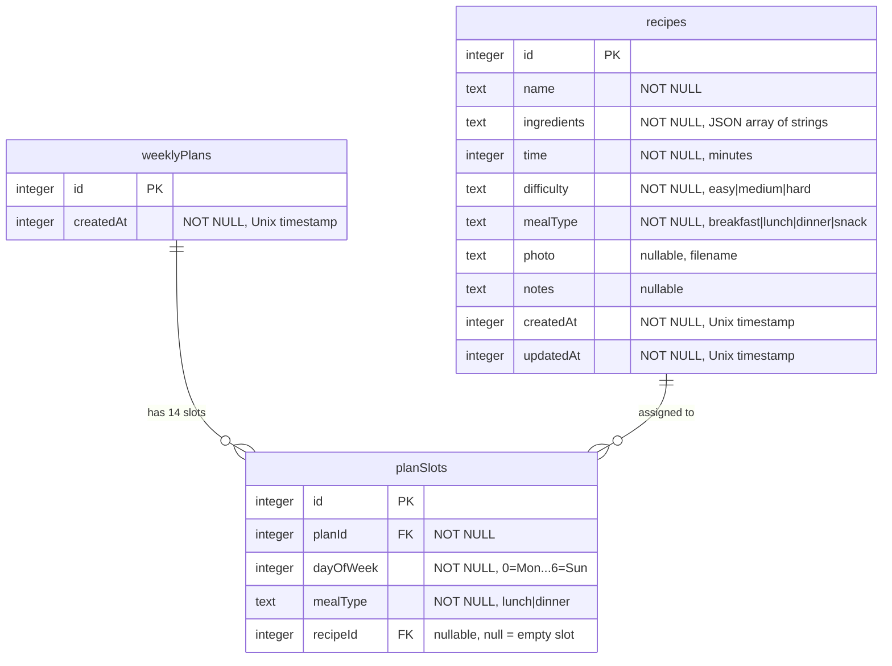

# Recipe Management and AI Meal Planning App

## Overview

Build a personal, mobile-first webapp for managing recipes and AI-powered weekly meal planning. The app allows a single user (no auth) to add recipes with photos, generate balanced weekly plans using Gemini AI, and get random recipe suggestions when undecided. All UI in Spanish.

**Tech stack:** Nuxt 4, SQLite + Drizzle ORM, Gemini API (`@google/genai`), Nuxt UI v4, Tailwind CSS v4.

## Problem Statement

Deciding what to cook every day is mentally draining. This app solves that by:
1. Centralizing recipes in one searchable place
2. Letting AI generate a balanced weekly plan from the user's own recipes
3. Offering a quick random pick when you just need one idea

## Design Decisions (from SpecFlow analysis)

These resolve ambiguities identified during specification analysis:

| Question | Decision | Rationale |
|---|---|---|
| Plan data model | `weeklyPlans` + `planSlots` tables (see schema below) | Needed for persistence; one active plan at a time |
| Delete recipe in active plan | Allow deletion, null out the plan slot, show "empty slot" UI | Blocking deletion is annoying; nulling is simple |
| Ingredients structure | JSON array of plain strings (e.g., `["2 tazas de harina", "3 huevos"]`) | Simplest to input on phone; one text field per ingredient |
| AI response format | Send `{ id, name, mealType, difficulty, time }` per recipe; expect `{ dayOfWeek, mealType, recipeId }[]` back | ID-based matching is robust; avoids fuzzy name matching |
| Minimum recipes for plan | 5 recipes minimum; repeats allowed when < 14 recipes | Practical threshold; blocking at 14 is too restrictive |
| Recipe detail view | Yes, read-only detail page at `/recetas/:id` | Fundamental screen; needed from plan slots and recipe list |
| Multiple meal types per recipe | No, single value | YAGNI; keep simple |
| Navigation | Bottom tab bar: Recetas, Plan, Sorpresa | Standard mobile pattern for 3 main sections |
| Plan calendar on mobile | Vertical scrollable list of day cards | 7-column grid unusable at 375px |
| Photo storage | `.data/uploads/`, served via `/api/uploads/:filename` | Outside public root; survives rebuilds |
| Photo size limit | 5 MB max; JPEG, PNG, WebP only | Reasonable for phone photos |
| Swap behavior | Local random pick (same mealType, not already in plan) | Instant, free, no API call needed |
| Plan dates | Generic Mon-Sun, no specific calendar dates | Simpler; avoids "stale plan" UX |
| Search scope | Recipe name only (SQLite LIKE) | Sufficient for personal collection |
| Recipe name uniqueness | Duplicates allowed | Not worth the constraint |

## Data Model



### Required fields for recipe creation
- `name` (min 1 char)
- `ingredients` (at least 1 ingredient)
- `time` (min 1 minute)
- `difficulty` (must be one of: easy, medium, hard)
- `mealType` (must be one of: breakfast, lunch, dinner, snack)

### Optional fields
- `photo` (file upload, max 5MB, JPEG/PNG/WebP)
- `notes` (free text)

## Page / Route Structure

| Route | Page | Description |
|---|---|---|
| `/` | Home | Redirects to `/recetas` |
| `/recetas` | Recipe list | Browse, search, filter recipes. Empty state with CTA for first recipe. |
| `/recetas/nueva` | Add recipe | Form to create a new recipe with photo upload |
| `/recetas/:id` | Recipe detail | Read-only view of a single recipe |
| `/recetas/:id/editar` | Edit recipe | Pre-filled form to edit; replace/remove photo |
| `/plan` | Weekly plan | View current plan; generate new plan; swap slots |
| `/sorpresa` | Random picker | Filter + "Surprise me" button with recipe reveal |

**Navigation:** Bottom tab bar with 3 tabs (visible on mobile, hidden on desktop in favor of top nav):
- "Recetas" (`i-lucide-book-open`) -> `/recetas`
- "Plan" (`i-lucide-calendar`) -> `/plan`
- "Sorpresa" (`i-lucide-sparkles`) -> `/sorpresa`

## Directory Structure

```
recetas-diarias/
├── .data/                          # gitignored
│   ├── db.sqlite3                  # SQLite database
│   └── uploads/                    # Uploaded photos
├── .env                            # NUXT_GEMINI_API_KEY (gitignored)
├── app/
│   ├── app.vue                     # UApp + NuxtLayout + NuxtPage
│   ├── assets/css/main.css         # Tailwind + Nuxt UI imports
│   ├── components/
│   │   ├── RecipeCard.vue          # Recipe card for grid/list
│   │   ├── RecipeForm.vue          # Shared form for add/edit
│   │   ├── PlanDayCard.vue         # Single day in the weekly plan
│   │   └── RandomReveal.vue        # Animation for random pick
│   ├── composables/
│   │   └── useRecipes.ts           # $fetch wrappers for recipe API
│   ├── layouts/
│   │   └── default.vue             # Bottom nav (mobile) + top nav (desktop)
│   └── pages/
│       ├── index.vue               # Redirect to /recetas
│       ├── recetas/
│       │   ├── index.vue           # Recipe list
│       │   ├── nueva.vue           # Add recipe
│       │   └── [id]/
│       │       ├── index.vue       # Recipe detail
│       │       └── editar.vue      # Edit recipe
│       ├── plan.vue                # Weekly plan
│       └── sorpresa.vue            # Random picker
├── server/
│   ├── api/
│   │   ├── recipes/
│   │   │   ├── index.get.ts        # GET /api/recipes (list, search, filter)
│   │   │   ├── index.post.ts       # POST /api/recipes (create)
│   │   │   ├── [id].get.ts         # GET /api/recipes/:id
│   │   │   ├── [id].put.ts         # PUT /api/recipes/:id (update)
│   │   │   └── [id].delete.ts      # DELETE /api/recipes/:id
│   │   ├── upload.post.ts          # POST /api/upload (photo upload)
│   │   ├── uploads/
│   │   │   └── [filename].get.ts   # GET /api/uploads/:filename (serve photos)
│   │   └── plan/
│   │       ├── index.get.ts        # GET /api/plan (current plan)
│   │       ├── generate.post.ts    # POST /api/plan/generate (AI generation)
│   │       ├── swap.post.ts        # POST /api/plan/swap (swap single slot)
│   │       └── index.delete.ts     # DELETE /api/plan (clear plan)
│   ├── db/
│   │   ├── schema.ts               # Drizzle schema (recipes, weeklyPlans, planSlots)
│   │   └── index.ts                # Database connection singleton
│   └── utils/
│       └── gemini.ts               # Gemini client singleton
├── drizzle/                        # Generated migration SQL files
├── drizzle.config.ts               # Drizzle Kit configuration
├── nuxt.config.ts
└── package.json
```

## Implementation Phases

### Phase 1: Foundation (database, server, layout)

Set up the core infrastructure that everything else depends on.

**1.1 Install dependencies**

```bash
npm install drizzle-orm better-sqlite3 @google/genai zod
npm install -D drizzle-kit @types/better-sqlite3
```

**1.2 Database setup**

- `server/db/schema.ts` — Define `recipes`, `weeklyPlans`, `planSlots` tables with Drizzle

```typescript
// server/db/schema.ts
import { sqliteTable, integer, text } from 'drizzle-orm/sqlite-core';

export const recipes = sqliteTable('recipes', {
  id: integer('id').primaryKey({ autoIncrement: true }),
  name: text('name').notNull(),
  ingredients: text('ingredients').notNull(), // JSON array of strings
  time: integer('time').notNull(),            // minutes
  difficulty: text('difficulty').notNull(),    // easy | medium | hard
  mealType: text('meal_type').notNull(),      // breakfast | lunch | dinner | snack
  photo: text('photo'),                       // filename in uploads dir
  notes: text('notes'),
  createdAt: integer('created_at', { mode: 'timestamp' }).notNull().$defaultFn(() => new Date()),
  updatedAt: integer('updated_at', { mode: 'timestamp' }).notNull().$defaultFn(() => new Date()),
});

export const weeklyPlans = sqliteTable('weekly_plans', {
  id: integer('id').primaryKey({ autoIncrement: true }),
  createdAt: integer('created_at', { mode: 'timestamp' }).notNull().$defaultFn(() => new Date()),
});

export const planSlots = sqliteTable('plan_slots', {
  id: integer('id').primaryKey({ autoIncrement: true }),
  planId: integer('plan_id').notNull().references(() => weeklyPlans.id, { onDelete: 'cascade' }),
  dayOfWeek: integer('day_of_week').notNull(), // 0=Monday ... 6=Sunday
  mealType: text('meal_type').notNull(),       // lunch | dinner
  recipeId: integer('recipe_id').references(() => recipes.id, { onDelete: 'set null' }),
});
```

- `server/db/index.ts` — Database connection with WAL mode and foreign keys
- `drizzle.config.ts` — Drizzle Kit config pointing to `.data/db.sqlite3`
- Add `db:generate`, `db:migrate`, `db:push`, `db:studio` scripts to `package.json`
- Run initial migration

**1.3 Nuxt config**

- Add `runtimeConfig` with `geminiApiKey` and Nitro storage for uploads
- Create `.env` with `NUXT_GEMINI_API_KEY`
- Update `.gitignore` to include `.data/`, `.env`

**1.4 Layout and navigation**

- `app/app.vue` — Add `<NuxtLayout>` wrapper
- `app/layouts/default.vue` — Bottom tab bar (mobile) + top nav (desktop)
- `app/pages/index.vue` — Redirect to `/recetas`

**Deliverable:** App runs with `npm run dev`, shows empty layout with navigation, database is initialized.

---

### Phase 2: Recipe CRUD

Build the complete recipe management feature.

**2.1 Server API routes**

- `server/api/recipes/index.get.ts` — List recipes with optional `?search=` and `?mealType=` and `?difficulty=` query params. Returns all fields. Ordered by `createdAt` DESC.
- `server/api/recipes/index.post.ts` — Create recipe. Validate with Zod on server side. Returns created recipe.
- `server/api/recipes/[id].get.ts` — Get single recipe by ID. 404 if not found.
- `server/api/recipes/[id].put.ts` — Update recipe. Validate with Zod. Update `updatedAt`.
- `server/api/recipes/[id].delete.ts` — Delete recipe. Also delete the uploaded photo file if one exists. Plan slots referencing this recipe get `recipeId` set to null (handled by `onDelete: 'set null'` in schema).

**2.2 Photo upload**

- `server/api/upload.post.ts` — Accept multipart form data. Validate MIME type (jpeg/png/webp) and size (5MB). Generate UUID filename. Store via Nitro `useStorage('uploads')`. Return `{ filename, url }`.
- `server/api/uploads/[filename].get.ts` — Serve uploaded files. Prevent directory traversal. Set `Cache-Control: public, max-age=31536000, immutable`. Set correct `Content-Type`.

**2.3 Recipe list page**

- `app/pages/recetas/index.vue` — Recipe grid (1 col mobile, 2 cols sm, 3 cols lg). Search bar at top. Filter chips for mealType and difficulty. Empty state with CTA "Agrega tu primera receta" when no recipes exist.
- `app/components/RecipeCard.vue` — Card showing photo (or placeholder), name, difficulty badge, time, mealType badge. Links to recipe detail.

**2.4 Add recipe page**

- `app/pages/recetas/nueva.vue` — Uses `RecipeForm` component.
- `app/components/RecipeForm.vue` — Reusable form for add and edit. Fields: name (UInput), time in minutes (UInputNumber), difficulty (USelect), mealType (USelect), ingredients (dynamic list of UInput fields with add/remove buttons), notes (UTextarea), photo (UFileUpload). Zod validation. On submit: upload photo first (if any), then POST recipe with the returned filename.

**2.5 Recipe detail page**

- `app/pages/recetas/[id]/index.vue` — Full recipe view: large photo, name, difficulty + time + mealType badges, ingredients list, notes. Edit button (navigates to edit page). Delete button with `UModal` confirmation dialog.

**2.6 Edit recipe page**

- `app/pages/recetas/[id]/editar.vue` — Pre-filled `RecipeForm`. On photo change: upload new photo, delete old photo file via a server util. On submit: PUT to update recipe.

**Deliverable:** Full recipe CRUD working end-to-end with photo upload, search, and filtering.

---

### Phase 3: Weekly Plan

Build AI-powered meal plan generation.

**3.1 Gemini utility**

- `server/utils/gemini.ts` — Singleton `useGemini()` that initializes `GoogleGenAI` with the API key from `runtimeConfig`.

**3.2 Plan generation API**

- `server/api/plan/generate.post.ts` — Core logic:
  1. Fetch all recipes from DB
  2. If < 5 recipes, return 400 with message "Agrega al menos 5 recetas para generar un plan"
  3. Build prompt with recipe list as `{ id, name, mealType, difficulty, time }[]`
  4. System instruction: "Eres un planificador de comidas. Genera un plan semanal de lunes a domingo con almuerzo y cena (14 comidas). Usa SOLO los IDs de recetas proporcionados. Balancea dificultad y variedad. Responde en JSON."
  5. Use `responseMimeType: 'application/json'` for structured output
  6. Parse response, validate all recipeIds exist in DB
  7. Delete any existing active plan (and its slots via cascade)
  8. Insert new `weeklyPlan` + 14 `planSlots`
  9. Return the plan with recipe details joined

**3.3 Plan API routes**

- `server/api/plan/index.get.ts` — Get the current active plan with all slots joined with recipe data. Return null if no plan exists.
- `server/api/plan/swap.post.ts` — Accept `{ slotId }`. Pick a random recipe of matching `mealType` that is not already in the current plan. Update the slot's `recipeId`. Return updated slot.
- `server/api/plan/index.delete.ts` — Delete the active plan (cascade deletes slots).

**3.4 Plan page**

- `app/pages/plan.vue` — States:
  - **No plan:** "Genera tu plan semanal" button. Show minimum recipe requirement if < 5 recipes.
  - **Loading:** Spinner with "Generando tu plan..." (Gemini can take 5-15 seconds)
  - **Plan exists:** Vertical list of 7 `PlanDayCard` components. "Regenerar" button at top with `UModal` confirmation.
- `app/components/PlanDayCard.vue` — Day name header (Lunes, Martes...). Two meal slots (Almuerzo, Cena). Each slot shows recipe name + small photo. Swap button per slot. Empty slot shows "Sin receta" with option to fill. Tap recipe name to navigate to recipe detail.

**Deliverable:** AI-powered weekly plan generation, display, and slot swapping working end-to-end.

---

### Phase 4: Random Picker

Build the fun "surprise me" feature.

**4.1 Random picker page**

- `app/pages/sorpresa.vue` — Filter section at top: optional mealType select, optional difficulty select. Big "Sorprendeme" button. When tapped:
  1. Fetch recipes matching filters from `/api/recipes?mealType=...&difficulty=...`
  2. If no matches: show friendly message "No hay recetas con estos filtros"
  3. Pick one randomly client-side
  4. Show recipe with a reveal animation (fade-in or card flip using `motion-v` which is already available via Nuxt UI)
- `app/components/RandomReveal.vue` — Animated recipe card. Shows photo, name, difficulty, time. "Ver receta" button to navigate to detail. "Otra vez" button to pick again.

**Deliverable:** Random recipe picker with filters and animation working.

---

### Phase 5: Polish

Final touches for a delightful experience.

- **Toast notifications** — Success/error toasts via `useToast()` for all CRUD operations and plan generation
- **Loading states** — Skeleton loaders on recipe list, spinner on plan generation and photo upload
- **Photo placeholders** — Default food illustration when no photo is uploaded
- **Responsive refinement** — Test and adjust Drawer vs Modal for recipe form on mobile vs desktop
- **Error handling** — Gemini API timeout/failure shows a friendly error with retry option
- **Empty states** — Distinct empty states for recipe list, plan page, and filtered views

**Deliverable:** Polished, production-ready app.

## Acceptance Criteria

### Functional Requirements

- [ ] User can add a recipe with name, time, ingredients, difficulty, meal type, and optionally a photo and notes
- [ ] User can edit and delete existing recipes
- [ ] User can browse recipes in a responsive grid with search and filtering by meal type and difficulty
- [ ] User can view a single recipe's full details
- [ ] User can generate a weekly meal plan (Mon-Sun, lunch + dinner) using Gemini AI
- [ ] Plan generation is blocked with a message if fewer than 5 recipes exist
- [ ] User can swap individual meal slots in the plan (local random replacement)
- [ ] User can regenerate the entire plan (with confirmation)
- [ ] User can use the random picker with optional meal type and difficulty filters
- [ ] Deleting a recipe that is in the active plan nulls out the plan slot
- [ ] All UI text is in Spanish
- [ ] Photo uploads are limited to 5MB, JPEG/PNG/WebP only

### Non-Functional Requirements

- [ ] Mobile-first responsive design (works well at 375px width)
- [ ] Bottom tab navigation on mobile, top nav on desktop
- [ ] Gemini API key is server-only (never exposed to client)
- [ ] Photo files are cleaned up when recipes are deleted or photos are replaced
- [ ] SQLite database uses WAL mode and foreign keys enabled

## Dependencies

| Dependency | Version | Purpose |
|---|---|---|
| `drizzle-orm` | latest | ORM for SQLite |
| `better-sqlite3` | latest | SQLite driver |
| `@google/genai` | latest | Gemini AI SDK (NOT the deprecated `@google/generative-ai`) |
| `zod` | latest | Schema validation for forms and API |
| `drizzle-kit` | latest (dev) | Database migration tooling |
| `@types/better-sqlite3` | latest (dev) | TypeScript types |

## References

- [Brainstorm document](../brainstorms/2026-02-13-recetas-diarias-brainstorm.md)
- [Nuxt 4 Server Routes](https://nuxt.com/docs/4.x/directory-structure/server)
- [Nuxt 4 Runtime Config](https://nuxt.com/docs/4.x/guide/going-further/runtime-config)
- [Drizzle ORM SQLite](https://orm.drizzle.team/docs/get-started-sqlite)
- [@google/genai SDK](https://www.npmjs.com/package/@google/genai)
- [Nuxt UI v4 Components](https://ui.nuxt.com/docs/components)
- [Nitro Storage](https://nitro.build/guide/storage)
